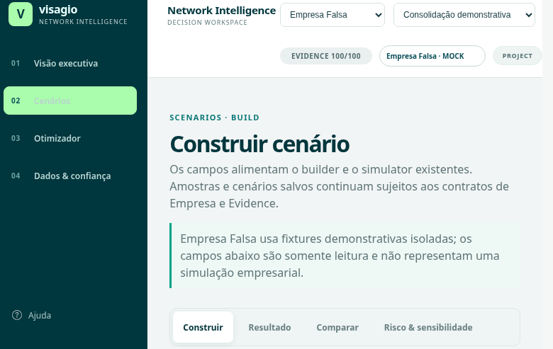
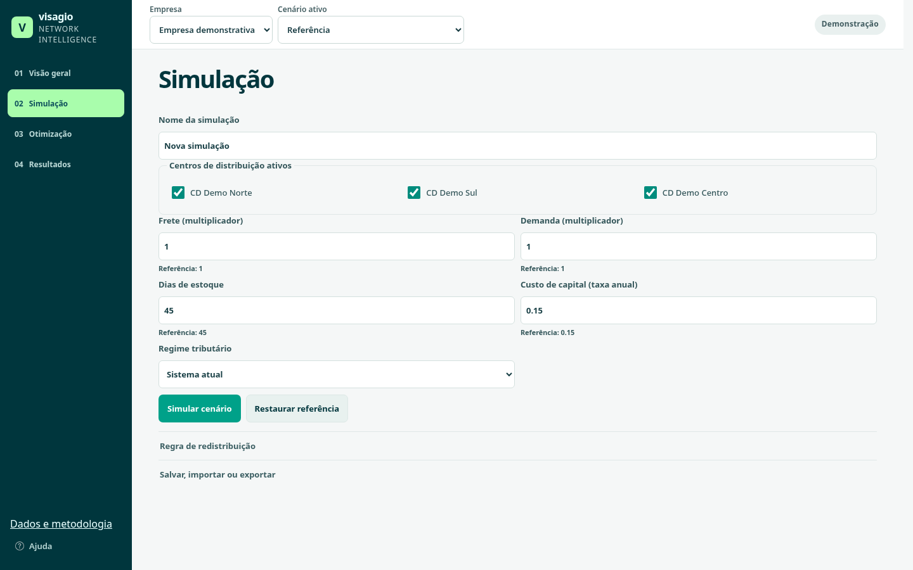
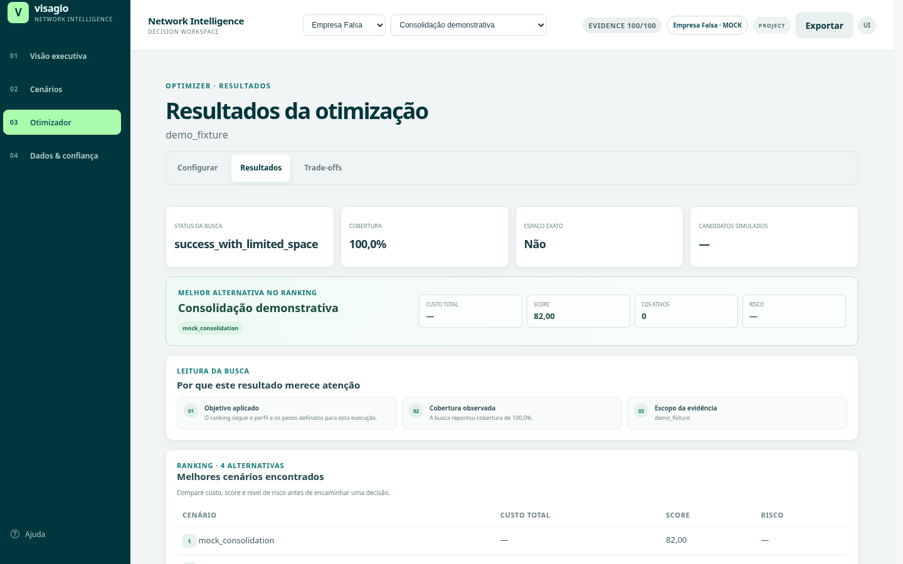
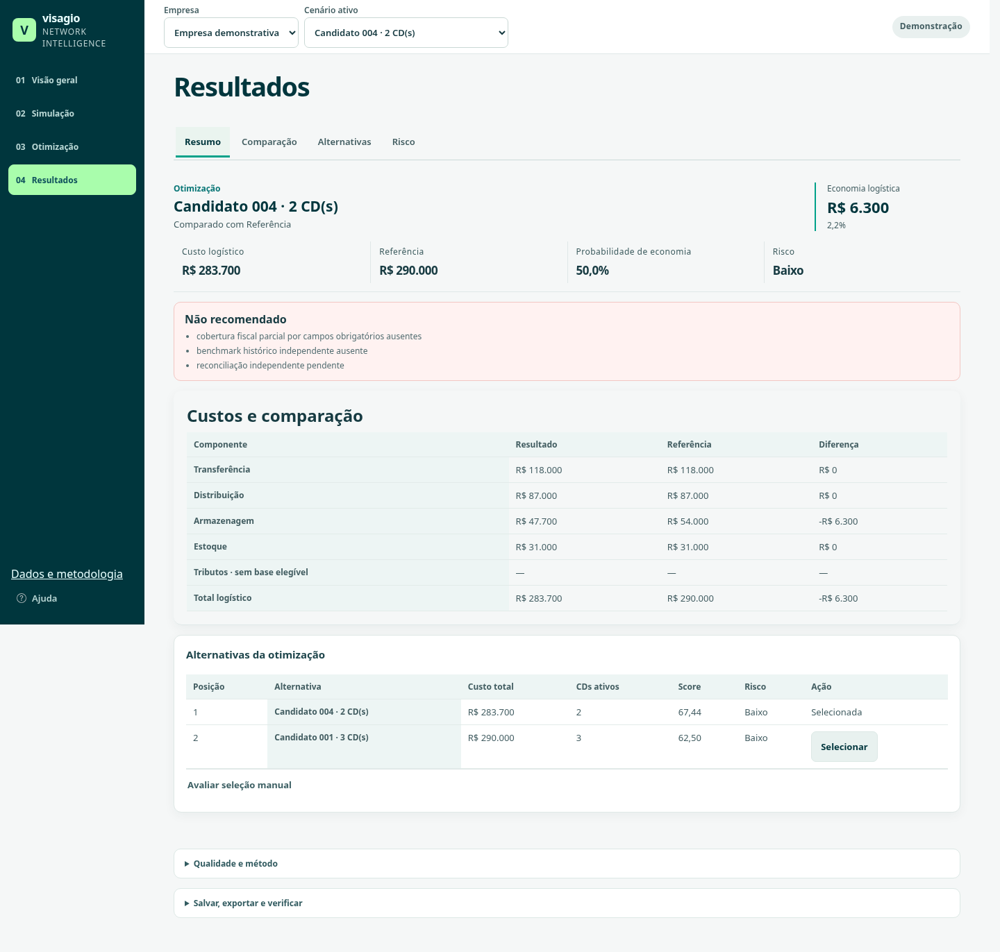

# Interface Visagio — implementação e validação de 02/10/2026

A interface mantém a paleta e os motores existentes. A jornada principal usa **Visão geral → Simulação → Otimização → Resultados**; dados, evidências, validação e metodologia ficam em acesso secundário. As referências visuais anyLogistix e Cosmic Frog orientaram a hierarquia e a redução de texto, conforme o plano inicial.

## Comportamento entregue

| Área | Resultado | Evidência principal |
|---|---|---|
| Navegação | Quatro áreas, contexto único de empresa e cenário, aliases antigos normalizados | Contratos do app e Playwright |
| Visão geral | Referência operacional, malha, custos e contexto fiscal; recomendações aparecem somente após cálculo | Playwright e renderizadores de overview |
| Simulação | Presets editáveis, todos os CDs disponíveis, campos validados, nome do cenário, salvar/importar/exportar | Jornada demo e jornadas Empresa 1/2 |
| Otimização | Objetivo e limites operacionais visíveis; parâmetros técnicos e de risco recolhidos | Execução do pipeline e seleção manual |
| Resultados | Custo, diferença, ranking com CDs e risco, comparação, alternativas e análise de risco | Engines existentes, testes de render e Playwright |
| Risco | Rascunho preservado ao navegar; matriz lê o formato real do engine; análise detalhada em segundo nível | Regressão do provider e Playwright |
| Estado | Edição invalida cálculos dependentes e exportações; troca de empresa descarta o contexto anterior | Contratos de estado, corrida assíncrona e E2E |
| Acesso | Uma frase de acesso configurada localmente; segredo não versionado; dados continuam criptografados | Validação dos envelopes e teste sintético de rotação |
| Responsividade | Sem overflow da página em 1440, 1024, 768, 390 e 360 px; quatro destinos visíveis; controles acessíveis por teclado | Playwright e revisão visual pelo MCP |

## Correções que afetam a interpretação

- O provider demonstrativo executa os motores de cenários, otimização, risco e decisão. Não devolve um resultado pré-calculado para um formulário alterado.
- Uma edição recebe nova identidade e não sobrescreve o preset. Salvar, importar e alternar cenários respeita a empresa ativa.
- A amostra demonstrativa não possui receita fiscal elegível. Quando o engine confirma essa ausência, sua referência é normalizada em memória para **R$ 290.000 de custo logístico**, com componente fiscal excluído da comparação. A economia não inclui o desaparecimento de um tributo fictício. As fixtures originais permanecem intactas; cobertura fiscal incompleta e uso exploratório estão registrados nos metadados e na interface.
- Arquivos JSON, HTML e CSV demonstrativos carregam identificação no próprio conteúdo. Empresas reais mantêm exportação agregada e passam pela proteção contra mistura de dados demonstrativos.
- Decisões bloqueadas mostram a causa no retorno à página de Resultados. Valores indisponíveis usam `—`; não são convertidos em sucesso ou cobertura completa.

## Validação

- `npm run quality`: **51 scripts**, final `ALL_PHASE5_PACKAGE_TESTS_OK`. Inclui Ruff, ESLint, Prettier, contratos, reconciliação, invariantes, engines, criptografia, apresentação e regressões de navegador.
- `VISAGIO_NETWORK_SERVE_DIR=/tmp/visagio-site-refactor/dist npm run test:public`: **29 scripts**, final `PUBLIC_SUITE_OK`. O teste Network Intelligence desse gate serviu o pacote público real.
- Últimos ajustes de rótulos fiscais: Playwright contra o pacote exato **`NETWORK_INTELLIGENCE_E2E_OK`** e padrões de código **`CODE_STANDARDS_CHECK_OK`**, ambos aprovados após esses ajustes.
- A jornada de navegador cobre demo, Empresa 1 e Empresa 2: frase incorreta, desbloqueio, execução, otimização, seleção manual, exportação, mudança de empresa, rascunhos, invalidação, aliases, refresh, envio repetido, falha de carregamento, foco e dispositivos menores.
- A rotação verifica todos os envelopes antes de escrever. O teste sintético cobre falha sem alterações, integridade de bytes/AAD/SHA, rejeição das frases antigas e reexecução sem recriptografar. No acervo desta branch, **162 envelopes** já usam a frase escolhida. Os **11 inputs criptografados** do runtime Sites foram recriptografados com preservação dos bytes decifrados.
- A busca pelas frases nas fontes versionáveis não encontrou ocorrências. `.env.local` permanece ignorado e com permissão `0600`.

## Antes e depois

As capturas abaixo usam a empresa demonstrativa. Os valores antigos não são usados como prova de cálculo; documentam a interface que motivou a revisão.

| Simulação antes | Simulação depois |
|---|---|
|  |  |

| Resultados antes | Resultados depois |
|---|---|
|  |  |

### Reorganização de dados e metodologia

A área **Dados e metodologia** passou a ser o centro da decisão. Ela agora reúne o cenário avaliado, o estado da recomendação, as ressalvas, os indicadores de evidência/robustez/validação/cobertura fiscal, as fontes consideradas e os limites de interpretação. A aba **Metodologia** também recebe a resolução de risco, sensibilidade e estresse quando há dados calculados.

Resultados ficou dedicado à leitura do custo e da comparação. A probabilidade de economia, o risco e o bloco técnico foram retirados do resumo para evitar repetição e linguagem meta; a tela mantém apenas um acesso curto para a confiabilidade e o método. A mudança foi conferida nos estados vazio e após simulação, em desktop e no fluxo de navegação entre as abas.

## Fonte e publicação

A branch `codex/interface-guiada` parte de `integration/final-delivery` em `481ee7b6216fbd2ec58a2b8ecb9732b84b309bd2`. A fonte exata do Sites v18 (`486820833a8398e5338f43ed69cd44ded7c9f749`) foi recuperada para conservar ajustes já publicados de gráficos, criptografia, loader e módulos de apresentação.

O repositório mantém a implementação e os testes completos. O Sites preserva o pacote de runtime enxuto: interface, motores, demo e 11 inputs de empresa criptografados. Planilhas originais, acervo documental, fontes brutas e configurações locais não integram a publicação. Complementos privados continuam marcados como não publicados nesse runtime; cobertura e resultados não equivalem aos do acervo local completo.

Publicação: **Sites v20**, deploy `succeeded`, em [Visagio](https://visagio-logistica.gptgrupo-especial.chatgpt.site). Código GitHub: `fa4f757`. Fonte Sites: `4bd509cd205ce118ff44d812a2565a00ac9031c6`. As árvores `assets` e `data-demo` do pacote coincidem byte a byte com esse commit de código; `build-info.json` registra a proveniência. A revisão está no [PR #3](https://github.com/Bulquerque/projeto_eng_de-_produ-o/pull/3).

O workflow GitHub instala Ruff, cryptography, Playwright e Chromium nos dois gates; a credencial de Actions foi alinhada à configuração escolhida, via stdin e sem alteração de fonte.

**Produção verificada:** `PRODUCTION_CODE_PROVENANCE_OK`, `PRODUCTION_DEMO_JOURNEY_OK`, `PRODUCTION_ACCESSIBILITY_AND_FAILURES_OK`, `PRODUCTION_CONCURRENCY_AND_ISOLATION_OK`, `PRODUCTION_BOTH_PROTECTED_TENANTS_OK` e `PRODUCTION_NETWORK_E2E_OK`. O Playwright MCP também conferiu o endereço publicado, o contexto inicial e o console (zero erros/avisos). O resultado do CI é acompanhado no PR; a validação local e a de produção já foram concluídas.

Nenhum teste elimina os limites metodológicos: Monte Carlo varia premissas e não comprova previsão histórica; uma busca discreta segue suas restrições; cobertura fiscal ausente permanece uma limitação real dos dados.

## Divisão de trabalho

Três subagentes Luna trabalharam em UX, CSS e consistência do provider/estado. A integração, revisão de diferenças, Playwright MCP, gates, GitHub e Sites ficaram com o coordenador. A revisão independente encontrou e confirmou problemas de IDs, matriz, bloqueio de decisão, exportação e base fiscal demonstrativa.
